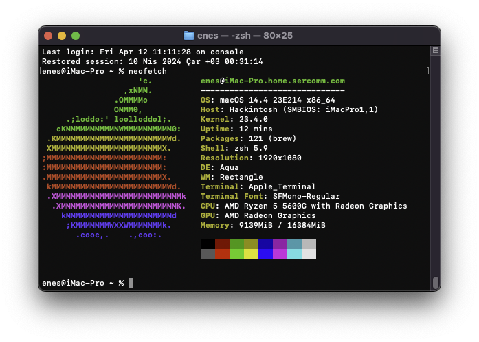

# Hackintosh • Ryzen 5600G • B550-A Pro
[OpenCore](https://dortania.github.io/OpenCore-Install-Guide) bootloader configuration for Ryzen 5 5600X on a MSI B550 A-Pro.

## Status

- ✅ Graphics
- ✅ iServices
- ✅ USB
- ✅ Audio

## Hardware

| Name     |                             Model |
| :------- | --------------------------------: |
| CPU      |                     Ryzen 5 5600G |
| GPU      |                     Raedon Vega 7 |
| RAM      |        Goodram IRDM PRO DDR4-3600 |
| SSD      |        Western Digital SN580 NVMe |
| Board    |                    MSI B550 A-Pro |
| Ethernet |              RTL8111H Gigabit LAN |
| Audio    |      Realtek® ALC892/ALC897 Codec |

## Firmware
| Driver       |         Version |
| :------------| --------------: |
| [OpenRuntime](https://github.com/acidanthera/OpenCorePkg/releases)  |           0.9.9 |

## Kexts

| Package                    | Version |
| :------------------------- | ------: |
| [VirtualSMC](https://github.com/acidanthera/VirtualSMC/releases)                 |   1.3.2 |
| [Lilu](https://github.com/acidanthera/Lilu/releases)                       |   1.6.7 |
| [NootedRed](https://github.com/ChefKissInc/NootedRed)              |   1.0.0 |
| [AppleALC](https://github.com/acidanthera/AppleALC/releases)                   |   1.8.9 |
| [RealtekRTL8111](https://github.com/Mieze/RTL8111_driver_for_OS_X/releases)             |   2.4.2 |
| [AppleMCEReporterDisabler](https://github.com/acidanthera/bugtracker/files/3703498/AppleMCEReporterDisabler.kext.zip)   |   1.2.0 |
| [AMDRyzenCPUPowerManagement](https://github.com/trulyspinach/SMCAMDProcessor/releases) |     0.7.2 |
| [SMCAMDProcessor](https://github.com/trulyspinach/SMCAMDProcessor/releases)            |     0.7.2 |
| [USBToolBox](https://github.com/USBToolBox/kext/releases)                 |   1.1.0 |
| [UTBMap](https://github.com/USBToolBox/kext/releases)                     |     0.7 |
| [RestrictEvents](https://github.com/acidanthera/RestrictEvents/releases)             |   1.1.3 |

## SSDTs
| SSDT                     |
| :----------------------- | 
| [SSDT-CPUR](https://github.com/dortania/Getting-Started-With-ACPI/blob/master/extra-files/compiled/SSDT-CPUR.aml) |
| [SSDT-EC-USBX-DESKTOP](https://github.com/dortania/Getting-Started-With-ACPI/blob/master/extra-files/compiled/SSDT-EC-USBX-DESKTOP.aml) |

## config.plist

Based on the [Ryzen and Threadripper(17h and 19h) Guide](https://dortania.github.io/OpenCore-Install-Guide/AMD/zen.html)

#### SMBIOS

Selected: `MacPro1,1`

Please generate your own device uuid and board serial.
[Click here for details](https://dortania.github.io/OpenCore-Install-Guide/AMD/zen.html#platforminfo)
